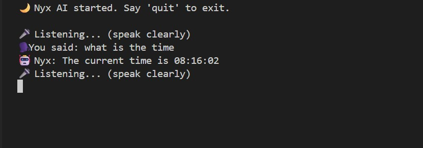

# Nyx_AI-Assistant
Voice-Activated Artificial Intelligence Assistant | Local AI Integration.  Currently not complete but provided a very simple base that people can use to make their own AIs. Do not forget to star if it interests you!


---

## Table of Contents

1. Overview
2. Features
3. System Requirements
4. Installation
5. Project Structure
6. Configuration
7. Usage Guide
8. Module Documentation
9. Tool Integrations
10. Voice Commands Reference
11. Screenshots
12. Troubleshooting
13. Performance Optimization
14. Security Notice
15. Disclaimer
16. License

---

## Overview

Nyx AI is a sophisticated voice-activated artificial intelligence assistant that combines speech recognition, text-to-speech synthesis and large language model capabilities with practical system tools. Named after the Greek goddess of the night, Nyx provides a hands-free interface for executing commands, retrieving information, performing calculations, managing system programs and even security testing through integrated tools.

The assistant operates through a conversational interface, supporting both voice and text input, with fallback mechanisms for reliable operation. Nyx leverages local language models via Ollama or cloud-based models through OpenRouter, with a modular architecture that supports extensible tool integration.

---

## Features

### Core Capabilities

| Feature | Description |
|---------|-------------|
| Voice Recognition | Real-time speech-to-text using Google Speech Recognition |
| Text-to-Speech | Natural voice output via pyttsx3 engine |
| Conversational Memory | Maintains context across conversation turns |
| Multi-Modal Input | Voice input with automatic fallback to keyboard |
| LLM Integration | Supports Ollama (local) and OpenRouter (cloud) models |
| Tool Calling | Pattern-based tool detection and execution |

### Integrated Tools

| Tool | Function |
|------|----------|
| Time Tool | Retrieves current system time |
| Calculator | Evaluates mathematical expressions |
| Wi-Fi Password Recovery | Displays saved Wi-Fi credentials |
| Program Manager | Opens, closes, and lists installed applications |
| Wi-Fi Cracker | Security testing tool for authorized networks |

### Voice Command Examples

| Category | Example Command |
|----------|-----------------|
| System Information | "What time is it?" |
| Calculations | "Calculate 15 times 7" |
| Application Control | "Open Google Chrome" |
| Application Control | "Close Notepad" |
| Application Discovery | "List all installed programs" |
| Network Security | "Show my Wi-Fi passwords" |
| Security Testing | "Crack wifi for Starbucks WiFi" |

---

## System Requirements

### Minimum Requirements

| Component | Requirement |
|-----------|-------------|
| Operating System | Windows 10/11, Linux (Ubuntu 20.04+), macOS 11+ |
| Processor | Dual-core 2.0 GHz |
| RAM | 4 GB |
| Disk Space | 2 GB (for local models) |
| Python Version | 3.9 or higher |
| Microphone | Required for voice input |
| Speakers/Headphones | Required for voice output |
| Internet | Required for cloud models and speech recognition |

### Required Python Packages

| Package | Version | Purpose |
|---------|---------|---------|
| langchain | 0.1.0+ | Agent framework |
| langchain-core | 0.1.0+ | Core LangChain utilities |
| langchain-openai | 0.0.5+ | OpenAI-compatible client |
| speech_recognition | 3.10+ | Microphone input processing |
| pyttsx3 | 2.90+ | Text-to-speech synthesis |
| openai | 1.0.0+ | LLM API client |
| requests | 2.31.0+ | HTTP requests |
| subprocess | Built-in | System command execution |
| re | Built-in | Pattern matching |
| json | Built-in | Data serialization |

### Installation Commands

```bash
# Clone or download the project
git clone [repository-url]
cd nyx-ai

# Install required packages
pip install langchain langchain-core langchain-openai speech_recognition pyttsx3 openai requests
```

---

## Installation

### Step 1: Install Python

Ensure Python 3.9 or higher is installed:

```bash
python --version
```

### Step 2: Install Dependencies

```bash
pip install langchain langchain-core langchain-openai speech_recognition pyttsx3 openai requests
```

### Step 3: Install Ollama (Optional - for local models)

For local LLM execution, install Ollama:

**Windows/macOS/Linux:**
```bash
# Visit https://ollama.ai and download the installer
# Then pull a model:
ollama pull llama3.2
```

**Alternative - OpenRouter (Cloud):**
Obtain an API key from https://openrouter.ai

### Step 4: Configure Model Client

Edit `src/nyx/model_client.py` to configure your preferred model:

```python
def get_model_client():
    # For Ollama (local):
    return {
        "client": OpenAI(base_url="http://localhost:11434/v1", api_key="ollama"),
        "model": "llama3.2"
    }
    
    # For OpenRouter (cloud):
    return {
        "client": OpenAI(base_url="https://openrouter.ai/api/v1", api_key="YOUR_API_KEY"),
        "model": "openai/gpt-3.5-turbo"
    }
```

### Step 5: Run Nyx

```bash
cd src
python -m nyx.main
```

Or from the project root:

```bash
python run.py
```

---

## Project Structure

```
nyx-ai/
│
├── run.py                         # Main entry point
├── requirements.txt               # Python dependencies
├── rockyou.txt                    # Password wordlist (optional)
├── nyx_memory.json                # Persistent memory storage
│
├── src/
│   └── nyx/
│       ├── __init__.py            # Package initializer
│       ├── main.py                # Application entry point
│       ├── agent.py               # NyxAgent core logic
│       ├── audio_io.py            # Speech recognition & synthesis
│       ├── memory.py              # Conversation memory management
│       ├── model_client.py        # LLM client configuration
│       ├── prompts.py             # System prompts and templates
│       │
│       └── tools/                 # Integrated tool modules
│           ├── __init__.py        # Tool exports
│           ├── time.py            # Current time retrieval
│           ├── calc.py            # Mathematical evaluation
│           ├── program_manager.py # Application management
│           ├── wifipasswords.py   # Saved Wi-Fi credential display
│           ├── wifi_cracker.py    # Wi-Fi security testing
│           └── memory_updater.py  # Memory management utilities
│
└── .vscode/                       # VS Code configuration (optional)
```

### File Descriptions

| File | Purpose |
|------|---------|
| `main.py` | Core loop orchestrating listen → agent → speak |
| `agent.py` | NyxAgent class with tool detection and LLM fallback |
| `audio_io.py` | Microphone input and text-to-speech output |
| `memory.py` | Conversation history management with persistence |
| `model_client.py` | LLM client configuration (Ollama/OpenRouter) |
| `prompts.py` | System prompt definitions |
| `tools/` | Individual tool implementations |

---

## Configuration

### Model Client Configuration (model_client.py)

```python
from openai import OpenAI

def get_model_client():
    """Returns configured LLM client and model name."""
    
    # Option 1: Local Ollama
    client = OpenAI(
        base_url="http://localhost:11434/v1",
        api_key="ollama"  # Not used but required
    )
    return {"client": client, "model": "llama3.2"}
    
    # Option 2: OpenRouter Cloud
    # client = OpenAI(
    #     base_url="https://openrouter.ai/api/v1",
    #     api_key="YOUR_API_KEY_HERE"
    # )
    # return {"client": client, "model": "openai/gpt-3.5-turbo"}
    
    # Option 3: Custom OpenAI-compatible endpoint
    # client = OpenAI(
    #     base_url="https://your-endpoint.com/v1",
    #     api_key="your-api-key"
    # )
    # return {"client": client, "model": "your-model-name"}
```

### System Prompt Configuration (prompts.py)

```python
NYX_SYSTEM_PROMPT = """You are Nyx, a voice-controlled AI assistant with access to various tools.
You have a conversational memory and can help with calculations, time queries, 
program management, Wi-Fi operations, and general questions.

Guidelines:
- Be concise and natural (voice output friendly)
- Use tools when appropriate
- Maintain conversation context
- Acknowledge when you can't do something
"""
```

### Memory Configuration (memory.py)

The memory system persists conversation history to `nyx_memory.json`:

```python
class Memory:
    def __init__(self, memory_file="nyx_memory.json", max_turns=10):
        self.memory_file = memory_file
        self.max_turns = max_turns
        self.messages = []
        self.load()
```

---

## Usage Guide

### Launching Nyx

```bash
# From project root
python run.py

# Or directly
cd src
python -m nyx.main
```

### Startup Output

```
🌙 Nyx AI started. Say 'quit' to exit.

🎤 Listening... (speak clearly)
```

### Interaction Flow

```
┌─────────────────────────────────────────────────────────────────┐
│                         Nyx AI Cycle                            │
│                                                                 │
│   ┌──────────┐     ┌──────────────┐     ┌───────────────────┐   │
│   │  Listen  │────▶│  Recognize   │────▶│  User Text        │  │
│   │  (Voice) │     │  (Google API)│     │  "What time is it?"│  │
│   └──────────┘     └──────────────┘     └─────────┬─────────┘   │
│                                                    │            │
│                                                    ▼            │
│   ┌──────────┐     ┌──────────────┐     ┌───────────────────┐   │
│   │  Speak   │◀────│  Generate    │◀────│  Agent Handle    │   │
│   │  Output  │     │  Response    │     │  + Tool Detection │   │
│   └──────────┘     └──────────────┘     └───────────────────┘   │
│                                                                 │
└─────────────────────────────────────────────────────────────────┘
```

### Voice Commands

**Basic Commands:**

| Command | Action |
|---------|--------|
| "What time is it?" | Returns current system time |
| "Time please" | Returns current system time |
| "Calculate 25 * 4" | Evaluates mathematical expression |
| "Show my Wi-Fi passwords" | Lists saved Wi-Fi credentials |

**Program Management:**

| Command | Action |
|---------|--------|
| "Open Chrome" | Launches Google Chrome |
| "Start Notepad" | Launches Notepad |
| "Close Calculator" | Closes Calculator application |
| "List programs" | Shows installed applications |
| "What programs are installed?" | Shows installed applications |

**Wi-Fi Cracking (Security Testing):**

| Command | Action |
|---------|--------|
| "Crack wifi for Starbucks WiFi" | Initiates security test on specified network |

**Exit Commands:**

| Command | Action |
|---------|--------|
| "quit" | Exits Nyx |
| "exit" | Exits Nyx |
| "bye" | Exits Nyx with farewell |

### Text Input Fallback

When voice recognition fails (timeout, unclear audio, or service error), Nyx automatically falls back to keyboard input:

```
⌨️ Type instead: [user types command]
```

---

## Module Documentation

### main.py

**Purpose:** Orchestrates the main application loop.

**Function:** `run_nyx()`

**Process:**
1. Initialize model client
2. Initialize memory
3. Initialize NyxAgent
4. Loop: Listen → Process → Speak

### agent.py

**Purpose:** NyxAgent class handling tool detection and LLM interaction.

**Class:** `NyxAgent`

**Attributes:**
| Attribute | Type | Description |
|-----------|------|-------------|
| `client` | OpenAI | LLM API client |
| `model` | str | Model identifier |
| `memory` | Memory | Conversation memory |
| `system_prompt` | str | System instructions |
| `tools` | dict | Available tools mapping |

**Tool Detection Priority:**

```python
1. "crack wifi" → wifi_cracker.handle_crack_wifi()
2. "time" → time.get_time()
3. "list/show programs" → program_manager.handle("list")
4. "open/start/launch" → program_manager.handle("open", target)
5. "close/kill/stop" → program_manager.handle("close", target)
6. "calc" → calc.calculate()
7. "wifipasswords" → wifipasswords.show_wifi_passwords()
8. Default → LLM fallback
```

### audio_io.py

**Purpose:** Handles voice input and output.

**Function:** `listen() -> str`
- Captures microphone input
- Uses Google Speech Recognition
- Falls back to keyboard input on failure
- Timeout: 8 seconds, Phrase limit: 10 seconds

**Function:** `speak(text: str) -> None`
- Prints response to console
- Converts text to speech via pyttsx3
- Handles TTS errors gracefully

### memory.py

**Purpose:** Manages conversation history with persistence.

**Class:** `Memory`

**Methods:**
| Method | Description |
|--------|-------------|
| `add(role, content)` | Adds message to memory |
| `to_messages(system_prompt)` | Returns formatted message list |
| `save()` | Persists to JSON file |
| `load()` | Loads from JSON file |
| `clear()` | Clears memory |

### tools/program_manager.py

**Purpose:** Manages system applications.

**Functions:**
| Function | Description |
|----------|-------------|
| `list_installed_programs()` | Returns formatted list of installed apps |
| `open_program(program_name)` | Launches application |
| `close_program(program_name)` | Terminates application |
| `handle(action, target)` | Dispatcher for program commands |

### tools/wifi_cracker.py

**Purpose:** Security testing tool for authorized Wi-Fi networks.

**Function:** `handle_crack_wifi(command_text: str) -> str`
- Parses target SSID from command
- Initiates crack attempt (placeholder for actual implementation)

---

## Tool Integrations

### Time Tool

**File:** `tools/time.py`

**Function:** `get_time() -> str`
```python
def get_time():
    from datetime import datetime
    return datetime.now().strftime("%I:%M %p")
```

### Calculator Tool

**File:** `tools/calc.py`

**Function:** `calculate(expression: str) -> str`
```python
def calculate(expression):
    try:
        # Remove "calc" prefix if present
        expr = expression.replace("calc", "").strip()
        result = eval(expr)
        return f"The result is {result}"
    except:
        return "Sorry, I couldn't calculate that."
```

### Wi-Fi Passwords Tool

**File:** `tools/wifipasswords.py`

**Function:** `show_wifi_passwords() -> str`
- Retrieves saved Wi-Fi profiles using `netsh wlan show profiles`
- Extracts passwords for each profile
- Returns formatted list or error message

### Program Manager Tool

**File:** `tools/program_manager.py`

**Functions:**
- `list_installed_programs()`: Enumerates Start Menu programs
- `open_program(name)`: Launches via `subprocess.Popen()`
- `close_program(name)`: Terminates via `taskkill` (Windows)

### Wi-Fi Cracker Tool

**File:** `tools/wifi_cracker.py`

**Function:** `handle_crack_wifi(command_text)`
- Placeholder for authorized security testing
- Parses SSID and initiates password testing

---

## Voice Commands Reference

### Complete Command List

| Category | Command | Tool Used |
|----------|---------|-----------|
| Time | "What time is it?" | time |
| Time | "Tell me the time" | time |
| Time | "Current time" | time |
| Calculation | "Calculate 5 + 3" | calc |
| Calculation | "What is 10 * 20?" | calc |
| Calculation | "Compute 100 / 4" | calc |
| Wi-Fi Passwords | "Show my Wi-Fi passwords" | wifipasswords |
| Wi-Fi Passwords | "What are my saved Wi-Fi passwords?" | wifipasswords |
| Program Open | "Open Chrome" | program_manager |
| Program Open | "Start Notepad" | program_manager |
| Program Open | "Launch Calculator" | program_manager |
| Program Open | "Run Spotify" | program_manager |
| Program Close | "Close Firefox" | program_manager |
| Program Close | "Kill Word" | program_manager |
| Program Close | "Stop Chrome" | program_manager |
| Program List | "List programs" | program_manager |
| Program List | "Show apps" | program_manager |
| Program List | "What programs are installed?" | program_manager |
| Wi-Fi Crack | "Crack wifi for NetworkName" | wifi_cracker |
| Exit | "quit", "exit", "bye" | N/A |

---

## Screenshots

### Screenshot 1: Nyx AI Main Interface



*Description: The terminal window showing Nyx AI running with the startup message "🌙 Nyx AI started. Say 'quit' to exit." The listening indicator "🎤 Listening... (speak clearly)" is displayed. After user voice input, the recognized text appears as "🗣️ You said: What time is it?" followed by the assistant response "🤖 Nyx: The current time is 2:45 PM." The conversation continues with additional commands and responses, demonstrating the voice interaction flow and tool detection.*

**Capture instructions:**
1. Open a terminal or command prompt
2. Navigate to the project directory
3. Run `python run.py`
4. Speak clearly into your microphone or type commands
5. Capture the terminal showing multiple interaction cycles
6. Ensure the output shows both recognized speech and assistant responses

---

## Troubleshooting

### Common Issues and Solutions

| Issue | Possible Cause | Solution |
|-------|---------------|----------|
| "No module named 'langchain'" | Missing dependency | `pip install langchain` |
| Microphone not working | No default microphone | Check system audio settings |
| Speech recognition timeout | Background noise | Speak clearly, reduce ambient noise |
| "Could not understand audio" | Unclear speech | Speak more clearly or use keyboard fallback |
| TTS engine not speaking | pyttsx3 driver issue | Install system dependencies |
| Ollama connection refused | Ollama not running | Start Ollama service |
| API key errors | Invalid OpenRouter key | Verify API key in model_client.py |
| Program won't open | Incorrect program name | Use exact program name from list |
| Wi-Fi passwords not showing | Insufficient privileges | Run as Administrator |

### Platform-Specific Notes

**Windows:**
- Program manager tool uses Start Menu enumeration
- Run as Administrator for Wi-Fi password retrieval
- TTS works natively

**Linux:**
- May require `espeak` or `festival` for TTS
- `sudo apt install espeak` on Debian/Ubuntu
- Program paths differ from Windows

**macOS:**
- May require `say` command for TTS fallback
- Program management limited compared to Windows

### Debugging Tips

**Enable verbose logging:**

Add to `main.py`:

```python
import logging
logging.basicConfig(level=logging.DEBUG)
```

**Test microphone independently:**

```python
import speech_recognition as sr
r = sr.Recognizer()
with sr.Microphone() as source:
    print("Say something...")
    audio = r.listen(source)
    print(r.recognize_google(audio))
```

**Test TTS independently:**

```python
import pyttsx3
engine = pyttsx3.init()
engine.say("Test")
engine.runAndWait()
```

---

## Performance Optimization

### Response Time Guidelines

| Operation | Expected Time |
|-----------|---------------|
| Voice recognition | 1-2 seconds |
| Local LLM (Ollama) | 2-10 seconds |
| Cloud LLM (OpenRouter) | 1-3 seconds |
| Tool execution | <1 second |

### Optimization Tips

| Area | Recommendation |
|------|----------------|
| Model Selection | Use smaller models (3B-7B parameters) for faster response |
| Memory Limit | Keep `max_turns` at 5-10 to reduce token usage |
| Background Noise | Configure ambient noise adjustment: `recognizer.adjust_for_ambient_noise(source, duration=1)` |
| TTS Engine | Pre-initialize engine in main thread |

---

## Security Notice

**IMPORTANT SECURITY CONSIDERATIONS**

1. **Wi-Fi Cracking Tool:** The `crack_wifi` functionality is a placeholder for authorized security testing. Unauthorized network access is illegal.

2. **Password Exposure:** The Wi-Fi passwords tool displays saved credentials in clear text. Use only on trusted systems.

3. **Program Manager:** The tool can open and close applications. Ensure you have appropriate permissions.

4. **Cloud API Usage:** If using OpenRouter, API keys may log prompts. Consider local Ollama for sensitive conversations.

5. **Microphone Access:** Ensure you trust the application before granting microphone permissions.

6. **Memory Persistence:** Conversation history is saved to `nyx_memory.json`. Clear this file if privacy is required.

---

## Disclaimer

1. **Educational Purpose:** Nyx AI is provided for educational and personal productivity use.

2. **No Warranty:** The software is provided "AS IS" without warranty of any kind.

3. **User Responsibility:** Users are responsible for compliance with applicable laws.

4. **Network Security:** Wi-Fi testing tools are for authorized networks only.

5. **API Costs:** Cloud API usage may incur costs. Users are responsible for their own API keys.

---

## License

This project is provided for personal and educational use.

---

## Version History

| Version | Date | Changes |
|---------|------|---------|
| 1.0 | 2026 | Initial release - Voice AI assistant with tool integrations |

---

## Credits

- **Developed By:** ILLUSIVEHACKS
- **AI Framework:** LangChain
- **Speech Recognition:** Google Speech Recognition API
- **Text-to-Speech:** pyttsx3
- **LLM Providers:** Ollama, OpenRouter

---

## Contact

For issues, suggestions or inquiries, please contact the developers through official channels.

---
